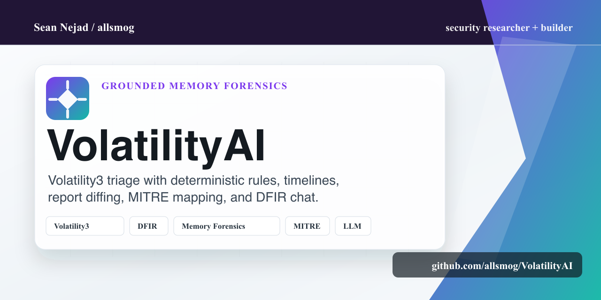

# VolatilityAI

**AI-Powered Memory Forensics Companion for Volatility3**

VolatilityAI combines [Volatility3](https://github.com/volatilityfoundation/volatility3)
memory forensics with deterministic DFIR rules and grounded LLM analysis.
It automates triage, validates findings against real plugin evidence, and
keeps investigation sessions available for timelines, diffs, and follow-up.



## At a glance

| Area | Details |
| --- | --- |
| Core workflow | Analyze memory dumps, validate findings, chat with forensic context |
| Evidence model | Grounded process, network, path, plugin, and MITRE references |
| Deterministic layer | Behavioral rules for suspicious processes, C2 indicators, malfind hits, hidden processes, and more |
| Outputs | JSON reports, timelines, report diffs, SQLite-backed sessions |
| Providers | Claude, OpenAI, local models, and OpenAI-compatible endpoints |

## Features

- **Automated Triage** (`volai analyze`) — runs Volatility3 plugins in parallel, sends results to an LLM, and produces a structured JSON forensic report with findings, severity ratings, MITRE ATT&CK mappings, and recommendations
- **Grounding & Validation** — every LLM finding is checked against actual plugin data (PIDs, process names, IPs, paths) and MITRE IDs are validated against a static lookup. Each finding gets a `grounded` flag and `confidence` score so you know what's real
- **Behavioral Detection Rules** — 10 built-in deterministic rules (suspicious svchost parent, typosquatting, C2 ports, malfind hits, hidden processes, etc.) that fire reliably regardless of LLM quality. Rule findings are fed into the LLM prompt and appear separately in the report
- **Interactive Chat** (`volai chat`) — REPL-based investigation session where you can run plugins on-the-fly and discuss findings with an AI forensic analyst
- **Session Persistence** — analyses and chat sessions are saved to SQLite. Resume chats, compare reports, export sessions as JSON
- **Timeline Extraction** (`volai timeline`) — builds a chronological view of events from plugin data (process creation, network connections, bash commands) without needing an LLM
- **Report Diffing** (`volai diff`) — compare two triage reports to see what changed: new/resolved findings, risk score delta, new PIDs, new network connections
- **Pluggable LLM Backends** — Claude (Anthropic), OpenAI, or any OpenAI-compatible endpoint (Ollama, vLLM, llama.cpp, etc.). Self-registering: add a new provider class and it appears in the CLI automatically
- **Graceful Degradation** — if the LLM fails or returns garbage, behavioral rules still produce actionable findings and enforce a risk score floor

## Installation

Requires **Python 3.11+**.

```bash
pip install .
```

For development:

```bash
pip install -e ".[dev]"
```

## Quick Start

### Automated Triage

```bash
# Using Claude
volai analyze memory.dmp --provider claude

# Using OpenAI
volai analyze memory.dmp --provider openai --model gpt-4o

# Using a local model (Ollama)
volai analyze memory.dmp --provider local --model llama3

# Save report to file
volai analyze memory.dmp --provider claude -o report.json

# Specify OS profile and custom plugins
volai analyze memory.dmp --provider openai --os-profile windows \
  --plugins "windows.pslist.PsList,windows.netscan.NetScan,windows.malfind.Malfind"

# Disable behavioral rules or session saving
volai analyze memory.dmp --provider claude --no-rules --no-save

# Tune LLM parameters
volai analyze memory.dmp --provider local --temperature 0.8 --max-tokens 8192

# Force JSON mode on/off (auto-detected per provider by default)
volai analyze memory.dmp --provider claude --json-mode
```

### Interactive Chat

```bash
volai chat memory.dmp --provider claude

# Resume a previous session
volai chat memory.dmp --provider claude --resume abc12345

# With custom LLM settings
volai chat memory.dmp --provider local --temperature 0.5 --max-tokens 16384
```

Chat commands:

| Command | Description |
|---|---|
| `/run <plugin>` | Run a Volatility3 plugin and add output to context |
| `/plugins` | List all available Volatility3 plugins |
| `/rules` | Run behavioral detection rules against collected plugin data |
| `/timeline` | Extract a timeline from collected plugin data |
| `/report` | Generate a summary report of the current session |
| `/sessions` | Show the current session ID |
| `/save` | Manually save a session checkpoint |
| `/help` | Show available commands |
| `/quit` | Exit the chat session |

### Timeline

```bash
volai timeline memory.dmp --provider local --model llama3 --format text
volai timeline memory.dmp --provider local --model llama3 --format json
volai timeline memory.dmp --provider local --model llama3 --format csv
```

### Session Management

```bash
volai sessions list                    # List all saved sessions
volai sessions list --type triage      # Filter by type
volai sessions show abc12345           # Show session detail
volai sessions show abc12345 --messages  # Include chat history
volai sessions export abc12345         # Export as JSON to stdout
volai sessions export abc12345 -o session.json
volai sessions delete abc12345 --force
```

### Report Diffing

```bash
volai diff <session_id_1> <session_id_2>
volai diff <session_id_1> <session_id_2> --format json
```

## Configuration

### LLM Provider (required)

Set via CLI flag or environment variable:

| Method | Example |
|---|---|
| CLI flag | `--provider claude` |
| Env var | `VOLAI_PROVIDER=claude` |

### API Keys

Keys are resolved in order: `--api-key` flag > `VOLAI_API_KEY` env var > provider-specific env var.

| Provider | Provider-specific env var | Default model |
|---|---|---|
| `claude` | `ANTHROPIC_API_KEY` | `claude-sonnet-4-20250514` |
| `openai` | `OPENAI_API_KEY` | `gpt-4o` |
| `local` | Not required | `llama3` |

### Local Models

Point `--base-url` at any OpenAI-compatible endpoint:

```bash
# Ollama (default: http://localhost:11434/v1)
volai analyze memory.dmp --provider local --model llama3

# Custom endpoint
volai analyze memory.dmp --provider local \
  --base-url http://localhost:8080/v1 --model my-model
```

### All Environment Variables

| Variable | Description |
|---|---|
| `VOLAI_PROVIDER` | LLM provider (`claude`, `openai`, `local`) |
| `VOLAI_MODEL` | Model name/ID |
| `VOLAI_API_KEY` | API key (overrides provider-specific vars) |
| `VOLAI_BASE_URL` | Base URL for local/custom endpoints |
| `VOLAI_DB_PATH` | SQLite database path (default: `~/.volai/volai.db`) |

### LLM Tuning Options

| Flag | Description | Default |
|---|---|---|
| `--temperature` | Sampling temperature | `0.2` |
| `--max-tokens` | Max tokens in LLM response | `4096` |
| `--json-mode` / `--no-json-mode` | Force JSON constrained output | Auto per provider |

When omitted, each provider uses sensible defaults. JSON mode is auto-enabled for providers that support it (OpenAI, local/Ollama) and disabled for those that don't (Claude).

## How It Works

### Analyze Pipeline

```
Memory Dump
    |
    v
VolatilityRunner.run_plugins_async()     -- plugins run in parallel
    |
    v
Plugin Results (structured dicts)
    |
    +---> Behavioral Rules Engine         -- 10 deterministic checks
    |         |
    |         v
    |     Rule Findings (B001-B010)
    |
    +---> build_triage_prompt()           -- plugin data + rule findings
    |
    v
LLM Backend.send()                       -- Claude / OpenAI / local
    |
    v
_parse_report()                          -- JSON parse with fallback
    |
    v
Grounding & Validation                   -- evidence vs. plugin data,
    |                                       MITRE ID validation
    v
Risk Score Floor                         -- max(llm_score, rule_floor)
    |
    v
TriageReport (JSON)                      -- findings, rule_findings,
    |                                       grounding_summary, etc.
    v
SessionStore.save()                      -- persisted to SQLite
```

### Behavioral Detection Rules

10 bundled rules that fire deterministically against plugin data:

| ID | Rule | Severity | MITRE |
|---|---|---|---|
| B001 | svchost.exe parent is not services.exe | high | T1036.005 |
| B002 | Process running from Temp directory | medium | T1204 |
| B003 | Process name typosquatting (scvhost, csrsss, etc.) | high | T1036.005 |
| B004 | Hidden process (in pslist but not pstree, or vice versa) | critical | T1564.001 |
| B005 | Connection on common C2 ports (4444, 5555, 1337, etc.) | medium | T1571 |
| B006 | Malfind hit (code injection indicator) | high | T1055 |
| B007 | cmd.exe/powershell.exe with unusual parent | medium | T1059 |
| B008 | Kernel module loaded from non-system32 path | medium | T1547.006 |
| B009 | 3+ processes with the same name (excluding normal duplicates) | low | T1055.012 |
| B010 | Service binary in temp/user directory | high | T1543.003 |

Rule findings set a risk score floor: critical=80, high=60, medium=40, low=20.

### Grounding

Each LLM-generated finding is validated:

- **Evidence** is checked against actual PIDs, process names, IPs, and file paths extracted from plugin output
- **MITRE ATT&CK IDs** are validated for format (`T####.###`) and checked against ~130 known technique IDs
- A `confidence` score is computed: `(grounded_evidence + valid_mitre) / total_checks`
- Findings with confidence < 0.5 are flagged as `grounded: false`

### Report Schema

```json
{
  "dump_path": "/path/to/memory.dmp",
  "analysis_timestamp": "2025-01-15T10:30:00Z",
  "os_detected": "Windows 10 x64",
  "llm_provider": "claude",
  "llm_model": "claude-sonnet-4-20250514",
  "summary": "Executive summary...",
  "findings": [
    {
      "title": "Suspicious Process Injection",
      "severity": "critical",
      "description": "Detailed explanation...",
      "evidence": ["PID 1234", "svchost.exe"],
      "mitre_attack": ["T1055"],
      "grounded": true,
      "confidence": 1.0,
      "grounding_details": {
        "evidence": [
          {"value": "PID 1234", "grounded": true, "match_type": "pid"}
        ],
        "mitre": [
          {"id": "T1055", "status": "valid"}
        ]
      }
    }
  ],
  "rule_findings": [
    {
      "title": "[VOLAI-B001] Suspicious svchost parent",
      "severity": "high",
      "evidence": ["PID 2048", "PPID 1024"],
      "mitre_attack": ["T1036.005"]
    }
  ],
  "risk_score": 85,
  "grounding_summary": {
    "total_findings": 4,
    "grounded_findings": 3,
    "ungrounded_findings": 1,
    "grounding_rate": 0.75
  },
  "recommendations": ["Isolate the host"],
  "plugin_outputs": [...],
  "errors": [...]
}
```

## Project Structure

```
src/volai/
├── cli.py                          # Click CLI (analyze, chat, timeline, diff, sessions)
├── config.py                       # Configuration resolution
├── llm/
│   ├── base.py                     # LLMBackend ABC + self-registering backend registry
│   ├── claude.py                   # Anthropic SDK backend
│   ├── openai.py                   # OpenAI SDK backend
│   └── local.py                    # Generic OpenAI-compatible backend
├── volatility/
│   ├── runner.py                   # Plugin execution + async parallel
│   ├── plugins.py                  # Triage plugin sets per OS
│   └── formatter.py                # TreeGrid -> dict conversion
├── analysis/
│   ├── triage.py                   # Automated triage orchestrator
│   ├── chat.py                     # Interactive chat REPL
│   ├── grounding.py                # Evidence & MITRE validation
│   ├── mitre_data.py               # Static MITRE ATT&CK technique IDs
│   ├── timeline.py                 # Timeline extraction
│   └── diff.py                     # Report diffing
├── rules/
│   ├── models.py                   # RuleFinding model
│   └── behavioral.py               # Rule engine + 10 bundled rules
├── storage/
│   ├── database.py                 # SQLite schema + connection
│   └── store.py                    # SessionStore CRUD
├── prompts/
│   ├── system.py                   # System prompt constants
│   └── templates.py                # Prompt formatting
└── report/
    └── models.py                   # Pydantic models (report, timeline, diff)
```

## Default Triage Plugins

Plugins are selected by OS profile. If no profile is specified, all are attempted (failures for wrong OS are handled gracefully).

**Windows:** `Info`, `PsList`, `PsTree`, `CmdLine`, `NetScan`, `Malfind`, `DllList`, `Handles`, `FileScan`, `SvcScan`, `Modules`

**Linux:** `PsList`, `PsTree`, `Bash`, `Lsof`, `Lsmod`, `Malfind`, `Sockstat`, `Elfs`, `Maps`

**macOS:** `PsList`, `PsTree`, `Bash`, `Lsof`, `Lsmod`, `Malfind`, `Netstat`, `Mount`

## Testing

```bash
# Run all tests (235 tests)
pytest tests/ -v

# Lint
ruff check src/ tests/

# Run the E2E feature demo (no LLM key needed — uses a fake HTTP server)
python -m tests.demo_e2e_features
```

## License

MIT
